# Troubleshooting Guide — PlantUML Gradle Plugin

> **Version**: 1.0.0  
> **Last Updated**: April 2026

Common issues and solutions for the PlantUML Gradle Plugin.

---

## Table of Contents

1. ["Plugin not found" — How to apply the plugin?](#1-plugin-not-found--how-to-apply-the-plugin)
2. ["Task not found" — Why tasks don't appear?](#2-task-not-found--why-tasks-dont-appear)
3. ["Connection refused" — LLM not responding](#3-connection-refused--llm-not-responding)
4. ["Timeout" — LLM request too slow](#4-timeout--llm-request-too-slow)
5. ["RAG directory not found" — Missing RAG index](#5-rag-directory-not-found--missing-rag-index)
6. ["Permission denied" — Files not readable](#6-permission-denied--files-not-readable)
7. ["JSON parsing error" — Malformed prompt](#7-json-parsing-error--malformed-prompt)
8. ["PlantUML syntax error" — Invalid diagram](#8-plantuml-syntax-error--invalid-diagram)
9. ["Out of memory" — Gradle lacks memory](#9-out-of-memory--gradle-lacks-memory)
10. ["Configuration not loaded" — YAML/properties ignored](#10-configuration-not-loaded--yamlproperties-ignored)

---

## 1. "Plugin not found" — How to apply the plugin?

### Symptom
```
Plugin [id: 'com.cheroliv.plantuml'] was not found in any of the following sources
```

### Solution

**Step 1**: Add plugin to `settings.gradle.kts` (recommended):
```kotlin
pluginManagement {
    repositories {
        mavenCentral()
        gradlePluginPortal()
    }
}

plugins {
    id("com.cheroliv.plantuml") version "1.0.0"
}
```

**Step 2**: Apply in `build.gradle.kts`:
```kotlin
plugins {
    id("com.cheroliv.plantuml") version "1.0.0"
}
```

**Alternative**: Apply in `build.gradle` (Groovy):
```groovy
plugins {
    id 'com.cheroliv.plantuml' version '1.0.0'
}
```

**Verify**:
```bash
./gradlew tasks --all | grep plantuml
```

---

## 2. "Task not found" — Why tasks don't appear?

### Symptom
```
Task 'processPlantumlPrompts' not found in root project
```

### Solution

**Step 1**: Verify plugin is applied:
```bash
./gradlew tasks --all | grep plantuml
```

Expected output:
```
PlantUML tasks
    processPlantumlPrompts
    validatePlantumlSyntax
    reindexPlantumlRag
```

**Step 2**: Check `build.gradle.kts`:
```kotlin
plugins {
    id("com.cheroliv.plantuml") version "1.0.0"
}
```

**Step 3**: Refresh Gradle:
```bash
./gradlew --stop
./gradlew tasks --all
```

**Step 4**: Verify configuration:
```kotlin
plantuml {
    prompts {
        inputDirectory.set(file("prompts"))
        outputDirectory.set(file("generated"))
    }
}
```

---

## 3. "Connection refused" — LLM not responding

### Symptom
```
java.net.ConnectException: Connection refused
```

### Solution

**For Ollama (local)**:

**Step 1**: Check Ollama is running:
```bash
ollama list
```

**Step 2**: Start Ollama if needed:
```bash
ollama serve
```

**Step 3**: Verify model is available:
```bash
ollama list | grep <model-name>
```

**Step 4**: Pull model if missing:
```bash
ollama pull <model-name>
```

**Step 5**: Check configuration (`plantuml-context.yml`):
```yaml
langchain:
  provider: ollama
  ollama:
    baseUrl: http://localhost:11434
    model: llama3.2
```

**For Cloud Providers** (OpenAI, Anthropic, etc.):

**Step 1**: Verify API key:
```yaml
langchain:
  apiKey: ${OPENAI_API_KEY}
```

**Step 2**: Set environment variable:
```bash
export OPENAI_API_KEY="your-key-here"
```

**Step 3**: Test connectivity:
```bash
curl https://api.openai.com/v1/models -H "Authorization: Bearer $OPENAI_API_KEY"
```

---

## 4. "Timeout" — LLM request too slow

### Symptom
```
java.util.concurrent.TimeoutException: Request timed out
```

### Solution

**Step 1**: Increase timeout in configuration:
```yaml
langchain:
  timeout: 120  # seconds (default: 60)
```

**Step 2**: For local LLM (Ollama), use lighter model:
```bash
ollama pull llama3.2:1b  # or smollm:135m
```

**Step 3**: Update config:
```yaml
langchain:
  model: smollm:135m
  timeout: 180
```

**Step 4**: Increase Gradle timeout:
```kotlin
// gradle.properties
org.gradle.jvmargs=-Xmx4g -Dorg.gradle.internal.http.connectionTimeout=180000 -Dorg.gradle.internal.http.socketTimeout=180000
```

**Step 5**: Run with info logging:
```bash
./gradlew processPlantumlPrompts --info
```

---

## 5. "RAG directory not found" — Missing RAG index

### Symptom
```
java.io.FileNotFoundException: RAG directory does not exist
```

### Solution

**Step 1**: Create RAG directory:
```bash
mkdir -p plantuml-plugin/rag
```

**Step 2**: Configure in `plantuml-context.yml`:
```yaml
rag:
  enabled: true
  directory: /absolute/path/to/rag
```

**Step 3**: Or use relative path in `build.gradle.kts`:
```kotlin
plantuml {
    rag {
        enabled.set(true)
        directory.set(file("rag"))
    }
}
```

**Step 4**: Run reindex task:
```bash
./gradlew reindexPlantumlRag
```

**Step 5**: Verify index:
```bash
ls -la rag/
```

---

## 6. "Permission denied" — Files not readable

### Symptom
```
java.nio.file.AccessDeniedException: /path/to/file
```

### Solution

**Step 1**: Check file permissions:
```bash
ls -la prompts/
```

**Step 2**: Fix permissions:
```bash
chmod 644 prompts/*.prompt
chmod 755 prompts/
```

**Step 3**: For output directory:
```bash
chmod 755 generated/
```

**Step 4**: Verify user ownership:
```bash
chown -R $USER:$USER prompts/ generated/
```

**Step 5**: On Windows (PowerShell):
```powershell
icacls prompts /grant Users:R /T
icacls generated /grant Users:RW /T
```

**Step 6**: Configure in `build.gradle.kts`:
```kotlin
plantuml {
    prompts {
        inputDirectory.set(file("prompts"))
        outputDirectory.set(file("generated"))
    }
}
```

Ensure paths are relative to project root.

---

## 7. "JSON parsing error" — Malformed prompt

### Symptom
```
com.fasterxml.jackson.core.JsonParseException: Unexpected character
```

### Solution

**Step 1**: Verify prompt format:

```plantuml
@startuml
' JSON: {"context": "description", "requirements": ["list"]}
class Diagram {
    +name: String
}
@enduml
```


**Step 2**: Check JSON syntax (must be valid):
```json
{
  "context": "valid description",
  "requirements": ["item1", "item2"]
}
```

**Step 3**: Escape special characters:
```plantuml
' JSON: {"context": "description with \"quotes\""}
```

**Step 4**: Use YAML alternative:

```plantuml
@startuml
' YAML:
' context: description
' requirements:
'   - item1
'   - item2
class Diagram { }
@enduml
```


**Step 5**: Validate with online tool:
- https://jsonlint.com/

---

## 8. "PlantUML syntax error" — Invalid diagram

### Symptom
```
PlantUML syntax error: Unexpected token
```

### Solution

**Step 1**: Run validation task:
```bash
./gradlew validatePlantumlSyntax
```

**Step 2**: Check common errors:
- Missing `@startuml` or `@enduml`
- Unclosed brackets `{ }`
- Invalid keywords

**Step 3**: Use online validator:
- https://www.plantuml.com/plantuml/

**Step 4**: Fix syntax:
```plantuml
@startuml  ' ✅ Required
class User {
    +name: String
    +email: String
}  ' ✅ Closing brace

interface Service {
    +execute(): void
}

User --> Service  ' ✅ Valid relationship
@enduml  ' ✅ Required
```

**Step 5**: Check output logs:
```bash
./gradlew processPlantumlPrompts --stacktrace
```

---

## 9. "Out of memory" — Gradle lacks memory

### Symptom
```
java.lang.OutOfMemoryError: Java heap space
```

### Solution

**Step 1**: Increase Gradle heap in `gradle.properties`:
```properties
org.gradle.jvmargs=-Xmx4g -XX:MaxMetaspaceSize=1g
```

**Step 2**: For large projects:
```properties
org.gradle.jvmargs=-Xmx8g -XX:MaxMetaspaceSize=2g -XX:+HeapDumpOnOutOfMemoryError
```

**Step 3**: Stop Gradle daemon:
```bash
./gradlew --stop
```

**Step 4**: Restart with new settings:
```bash
./gradlew processPlantumlPrompts
```

**Step 5**: Monitor memory:
```bash
./gradlew processPlantumlPrompts --profile
```

**Step 6**: Reduce batch size (if processing many files):
```kotlin
plantuml {
    processing {
        batchSize.set(10)  // default: 50
    }
}
```

---

## 10. "Configuration not loaded" — YAML/properties ignored

### Symptom
Plugin uses default settings despite custom configuration.

### Solution

**Step 1**: Verify file location:
```
project-root/
├── plantuml-context.yml      ' ✅ Correct
├── build.gradle.kts
└── settings.gradle.kts
```

**Step 2**: Check file name (exact match required):
- `plantuml-context.yml` ✅
- `plantuml-context.yaml` ✅
- `config.yml` ❌

**Step 3**: Verify YAML syntax:
```yaml
langchain:
  provider: ollama
  timeout: 60
```

**Step 4**: Validate with linter:
```bash
yamllint plantuml-context.yml
```

**Step 5**: Use environment variables:
```yaml
langchain:
  apiKey: ${OPENAI_API_KEY}
```

**Step 6**: Set in shell:
```bash
export OPENAI_API_KEY="your-key"
```

**Step 7**: Override in `build.gradle.kts`:
```kotlin
plantuml {
    langchain {
        provider.set("ollama")
        timeout.set(120)
    }
}
```

**Step 8**: Check configuration is loaded:
```bash
./gradlew processPlantumlPrompts --info | grep "Loading config"
```

---

## Additional Resources

- **Documentation**: `README_truth.adoc`
- **Examples**: `prompts/` directory
- **Issues**: https://github.com/anomalyco/plantuml-gradle/issues
- **Discussions**: https://github.com/anomalyco/plantuml-gradle/discussions

---

## Getting Help

If your issue is not listed:

1. **Check logs**:
   ```bash
   ./gradlew <task> --stacktrace
   ./gradlew <task> --info
   ```

2. **Search existing issues**:
   https://github.com/anomalyco/plantuml-gradle/issues

3. **Create new issue** with:
   - Gradle version
   - Plugin version
   - Configuration (redact secrets)
   - Full error message
   - Steps to reproduce

4. **Community support**:
   https://github.com/anomalyco/plantuml-gradle/discussions
