# Guide de Dépannage — Plugin PlantUML Gradle

> **Version** : 1.0.0  
> **Dernière mise à jour** : Avril 2026

Problèmes courants et solutions pour le Plugin PlantUML Gradle.

---

## Table des Matières

1. ["Plugin not found" — Comment appliquer le plugin ?](#1-plugin-not-found--comment-appliquer-le-plugin)
2. ["Task not found" — Pourquoi les tâches n'apparaissent pas ?](#2-task-not-found--pourquoi-les-tâches-napparaissent-pas)
3. ["Connection refused" — LLM ne répond pas](#3-connection-refused--llm-ne-répond-pas)
4. ["Timeout" — Requête LLM trop lente](#4-timeout--requête-llm-trop-lente)
5. ["RAG directory not found" — Index RAG manquant](#5-rag-directory-not-found--index-rag-manquant)
6. ["Permission denied" — Fichiers non lisibles](#6-permission-denied--fichiers-non-lisibles)
7. ["JSON parsing error" — Prompt mal formaté](#7-json-parsing-error--prompt-mal-formaté)
8. ["PlantUML syntax error" — Diagramme invalide](#8-plantuml-syntax-error--diagramme-invalide)
9. ["Out of memory" — Gradle manque de mémoire](#9-out-of-memory--gradle-manque-de-mémoire)
10. ["Configuration not loaded" — YAML/properties ignorés](#10-configuration-not-loaded--yamlproperties-ignorés)

---

## 1. "Plugin not found" — Comment appliquer le plugin ?

### Symptôme
```
Plugin [id: 'com.cheroliv.plantuml'] was not found in any of the following sources
```

### Solution

**Étape 1** : Ajouter le plugin dans `settings.gradle.kts` (recommandé) :
```kotlin
pluginManagement {
    repositories {
        mavenCentral()
        gradlePluginPortal()
    }
}

plugins {
    id("com.cheroliv.plantuml") version "1.0.0"
}
```

**Étape 2** : Appliquer dans `build.gradle.kts` :
```kotlin
plugins {
    id("com.cheroliv.plantuml") version "1.0.0"
}
```

**Alternative** : Appliquer dans `build.gradle` (Groovy) :
```groovy
plugins {
    id 'com.cheroliv.plantuml' version '1.0.0'
}
```

**Vérifier** :
```bash
./gradlew tasks --all | grep plantuml
```

---

## 2. "Task not found" — Pourquoi les tâches n'apparaissent pas ?

### Symptôme
```
Task 'processPlantumlPrompts' not found in root project
```

### Solution

**Étape 1** : Vérifier que le plugin est appliqué :
```bash
./gradlew tasks --all | grep plantuml
```

Sortie attendue :
```
PlantUML tasks
    processPlantumlPrompts
    validatePlantumlSyntax
    reindexPlantumlRag
```

**Étape 2** : Vérifier `build.gradle.kts` :
```kotlin
plugins {
    id("com.cheroliv.plantuml") version "1.0.0"
}
```

**Étape 3** : Rafraîchir Gradle :
```bash
./gradlew --stop
./gradlew tasks --all
```

**Étape 4** : Vérifier la configuration :
```kotlin
plantuml {
    prompts {
        inputDirectory.set(file("prompts"))
        outputDirectory.set(file("generated"))
    }
}
```

---

## 3. "Connection refused" — LLM ne répond pas

### Symptôme
```
java.net.ConnectException: Connection refused
```

### Solution

**Pour Ollama (local)** :

**Étape 1** : Vérifier qu'Ollama tourne :
```bash
ollama list
```

**Étape 2** : Démarrer Ollama si nécessaire :
```bash
ollama serve
```

**Étape 3** : Vérifier que le modèle est disponible :
```bash
ollama list | grep <nom-modele>
```

**Étape 4** : Télécharger le modèle si manquant :
```bash
ollama pull <nom-modele>
```

**Étape 5** : Vérifier la configuration (`plantuml-context.yml`) :
```yaml
langchain:
  provider: ollama
  ollama:
    baseUrl: http://localhost:11434
    model: llama3.2
```

**Pour les providers cloud** (OpenAI, Anthropic, etc.) :

**Étape 1** : Vérifier la clé API :
```yaml
langchain:
  apiKey: ${OPENAI_API_KEY}
```

**Étape 2** : Définir la variable d'environnement :
```bash
export OPENAI_API_KEY="votre-clé-ici"
```

**Étape 3** : Tester la connectivité :
```bash
curl https://api.openai.com/v1/models -H "Authorization: Bearer $OPENAI_API_KEY"
```

---

## 4. "Timeout" — Requête LLM trop lente

### Symptôme
```
java.util.concurrent.TimeoutException: Request timed out
```

### Solution

**Étape 1** : Augmenter le timeout dans la configuration :
```yaml
langchain:
  timeout: 120  # secondes (défaut : 60)
```

**Étape 2** : Pour LLM local (Ollama), utiliser un modèle plus léger :
```bash
ollama pull llama3.2:1b  # ou smollm:135m
```

**Étape 3** : Mettre à jour la config :
```yaml
langchain:
  model: smollm:135m
  timeout: 180
```

**Étape 4** : Augmenter le timeout Gradle :
```kotlin
// gradle.properties
org.gradle.jvmargs=-Xmx4g -Dorg.gradle.internal.http.connectionTimeout=180000 -Dorg.gradle.internal.http.socketTimeout=180000
```

**Étape 5** : Exécuter avec logs détaillés :
```bash
./gradlew processPlantumlPrompts --info
```

---

## 5. "RAG directory not found" — Index RAG manquant

### Symptôme
```
java.io.FileNotFoundException: RAG directory does not exist
```

### Solution

**Étape 1** : Créer le répertoire RAG :
```bash
mkdir -p plantuml-plugin/rag
```

**Étape 2** : Configurer dans `plantuml-context.yml` :
```yaml
rag:
  enabled: true
  directory: /chemin/absolu/vers/rag
```

**Étape 3** : Ou utiliser un chemin relatif dans `build.gradle.kts` :
```kotlin
plantuml {
    rag {
        enabled.set(true)
        directory.set(file("rag"))
    }
}
```

**Étape 4** : Exécuter la tâche de réindexation :
```bash
./gradlew reindexPlantumlRag
```

**Étape 5** : Vérifier l'index :
```bash
ls -la rag/
```

---

## 6. "Permission denied" — Fichiers non lisibles

### Symptôme
```
java.nio.file.AccessDeniedException: /path/to/file
```

### Solution

**Étape 1** : Vérifier les permissions :
```bash
ls -la prompts/
```

**Étape 2** : Corriger les permissions :
```bash
chmod 644 prompts/*.prompt
chmod 755 prompts/
```

**Étape 3** : Pour le répertoire de sortie :
```bash
chmod 755 generated/
```

**Étape 4** : Vérifier la propriété :
```bash
chown -R $USER:$USER prompts/ generated/
```

**Étape 5** : Sous Windows (PowerShell) :
```powershell
icacls prompts /grant Users:R /T
icacls generated /grant Users:RW /T
```

**Étape 6** : Configurer dans `build.gradle.kts` :
```kotlin
plantuml {
    prompts {
        inputDirectory.set(file("prompts"))
        outputDirectory.set(file("generated"))
    }
}
```

S'assurer que les chemins sont relatifs à la racine du projet.

---

## 7. "JSON parsing error" — Prompt mal formaté

### Symptôme
```
com.fasterxml.jackson.core.JsonParseException: Unexpected character
```

### Solution

**Étape 1** : Vérifier le format du prompt :

```plantuml
@startuml
' JSON: {"context": "description", "requirements": ["liste"]}
class Diagram {
    +name: String
}
@enduml
```


**Étape 2** : Vérifier la syntaxe JSON (doit être valide) :
```json
{
  "context": "description valide",
  "requirements": ["element1", "element2"]
}
```

**Étape 3** : Échapper les caractères spéciaux :
```plantuml
' JSON: {"context": "description avec \"guillemets\""}
```

**Étape 4** : Utiliser l'alternative YAML :

```plantuml
@startuml
' YAML:
' context: description
' requirements:
'   - element1
'   - element2
class Diagram { }
@enduml
```


**Étape 5** : Valider avec un outil en ligne :
- https://jsonlint.com/

---

## 8. "PlantUML syntax error" — Diagramme invalide

### Symptôme
```
PlantUML syntax error: Unexpected token
```

### Solution

**Étape 1** : Exécuter la tâche de validation :
```bash
./gradlew validatePlantumlSyntax
```

**Étape 2** : Vérifier les erreurs courantes :
- `@startuml` ou `@enduml` manquant
- Accolades non fermées `{ }`
- Mots-clés invalides

**Étape 3** : Utiliser le validateur en ligne :
- https://www.plantuml.com/plantuml/

**Étape 4** : Corriger la syntaxe :
```plantuml
@startuml  ' ✅ Requis
class User {
    +name: String
    +email: String
}  ' ✅ Accolade fermante

interface Service {
    +execute(): void
}

User --> Service  ' ✅ Relation valide
@enduml  ' ✅ Requis
```

**Étape 5** : Vérifier les logs de sortie :
```bash
./gradlew processPlantumlPrompts --stacktrace
```

---

## 9. "Out of memory" — Gradle manque de mémoire

### Symptôme
```
java.lang.OutOfMemoryError: Java heap space
```

### Solution

**Étape 1** : Augmenter la heap Gradle dans `gradle.properties` :
```properties
org.gradle.jvmargs=-Xmx4g -XX:MaxMetaspaceSize=1g
```

**Étape 2** : Pour les gros projets :
```properties
org.gradle.jvmargs=-Xmx8g -XX:MaxMetaspaceSize=2g -XX:+HeapDumpOnOutOfMemoryError
```

**Étape 3** : Arrêter le daemon Gradle :
```bash
./gradlew --stop
```

**Étape 4** : Redémarrer avec les nouveaux paramètres :
```bash
./gradlew processPlantumlPrompts
```

**Étape 5** : Surveiller la mémoire :
```bash
./gradlew processPlantumlPrompts --profile
```

**Étape 6** : Réduire la taille des lots (si traitement de nombreux fichiers) :
```kotlin
plantuml {
    processing {
        batchSize.set(10)  # défaut : 50
    }
}
```

---

## 10. "Configuration not loaded" — YAML/properties ignorés

### Symptôme
Le plugin utilise les paramètres par défaut malgré la configuration personnalisée.

### Solution

**Étape 1** : Vérifier l'emplacement du fichier :
```
project-root/
├── plantuml-context.yml      ' ✅ Correct
├── build.gradle.kts
└── settings.gradle.kts
```

**Étape 2** : Vérifier le nom du fichier (correspondance exacte requise) :
- `plantuml-context.yml` ✅
- `plantuml-context.yaml` ✅
- `config.yml` ❌

**Étape 3** : Vérifier la syntaxe YAML :
```yaml
langchain:
  provider: ollama
  timeout: 60
```

**Étape 4** : Valider avec un linter :
```bash
yamllint plantuml-context.yml
```

**Étape 5** : Utiliser les variables d'environnement :
```yaml
langchain:
  apiKey: ${OPENAI_API_KEY}
```

**Étape 6** : Définir dans le shell :
```bash
export OPENAI_API_KEY="votre-clé"
```

**Étape 7** : Surcharger dans `build.gradle.kts` :
```kotlin
plantuml {
    langchain {
        provider.set("ollama")
        timeout.set(120)
    }
}
```

**Étape 8** : Vérifier que la configuration est chargée :
```bash
./gradlew processPlantumlPrompts --info | grep "Loading config"
```

---

## Ressources Additionnelles

- **Documentation** : `README_truth_fr.adoc`
- **Exemples** : Répertoire `prompts/`
- **Issues** : https://github.com/anomalyco/plantuml-gradle/issues
- **Discussions** : https://github.com/anomalyco/plantuml-gradle/discussions

---

## Obtenir de l'Aide

Si votre problème n'est pas listé :

1. **Vérifier les logs** :
   ```bash
   ./gradlew <tâche> --stacktrace
   ./gradlew <tâche> --info
   ```

2. **Rechercher dans les issues existantes** :
   https://github.com/anomalyco/plantuml-gradle/issues

3. **Créer une nouvelle issue** avec :
   - Version de Gradle
   - Version du plugin
   - Configuration (masquer les secrets)
   - Message d'erreur complet
   - Étapes pour reproduire

4. **Support communautaire** :
   https://github.com/anomalyco/plantuml-gradle/discussions
